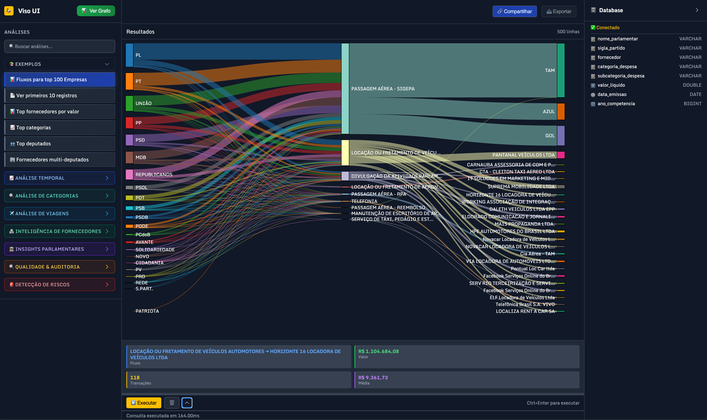

# 🕸️ VISO - Interactive Visualization of Obscure Systems

Explore federal deputies' expenses through interactive visualizations and direct SQL queries against Chamber of Deputies data.

💡 **Sample**: Expenses greater than R$1000 from the last 5 years.

## 🎯 What you can discover
- **How much each deputy spends** and connections with companies
- **Suspicious patterns** between politicians and companies
- **Custom analyses** through SQL queries

## 🔧 Two Integrated Interfaces

### 📊 Network Visualization
Main interface with an interactive graph of deputy-company connections.
- **Blue nodes**: Deputies | **Red nodes**: Companies
- **Smart filters**: party, category, minimum value
- **Interactive**: zoom, pan, click for details
- **🆕 Shareable URLs**: Direct links to specific deputies and companies

### 🗄️ SQL Explorer
Tool for advanced analysis with custom queries.
- **Predefined queries** for common analyses
- **Professional editor** with syntax highlighting
- **Fast execution** (Ctrl+Enter) and paginated results

### 🔗 Shareable URLs
- **Direct Links**: Share specific visualizations with unique URLs
- **Intuitive Format**: `/deputado-nome-e-partido` and `/empresa-nome-empresa`
- **Natural Navigation**: Browser back/forward buttons work perfectly
- **Compatibility**: Old URLs continue to work for a smooth transition

## 📈 Use Cases
**Professionals**: Investigative journalists, researchers, lawyers, activists
**Citizens**: Public oversight, getting to know candidates, democratic learning
**Expected results**: Greater transparency, more accountable deputies, strengthened democracy

## 🔒 Ethics and Responsibility
- **100% public data** official from the Chamber of Deputies
- **Responsible use**: always provide context, don't make accusations without in-depth investigation
- **Presumption of innocence**: data shows spending, doesn't prove wrongdoing

## 🛠️ Technology Stack
- **Frontend**: HTML5, Tailwind CSS, JavaScript ES6+
- **Database**: DuckDB WASM for SQL in the browser
- **Visualization**: D3.js for interactive charts
- **Editor**: Monaco (VS Code web)
- **Data**: Parquet for optimized performance
- **🆕 Storage**: OPFS (Origin Private File System) for local persistence
- **🆕 Workers**: Dedicated Web Workers for asynchronous processing
- **🆕 Cache**: Multi-layer cache system with compression
- **🆕 Offline**: Full support for offline mode
- **🆕 Routing**: Shareable URL system with SPA navigation

### ⚡ Optimized Performance
- **Instant Loading**: Cached data loads immediately
- **Dedicated Workers**: Heavy processing in the background
- **Works Offline**: Core features available without internet
- **Automatic Sync**: Automatic update when back online
- **Local Storage**: Data persists between sessions using OPFS

---

💡 **Tip**: Use both interfaces! Explore visually in the graph, then run specific queries in SQL.

---

*Developed to strengthen Brazilian democracy through transparency and public oversight*
