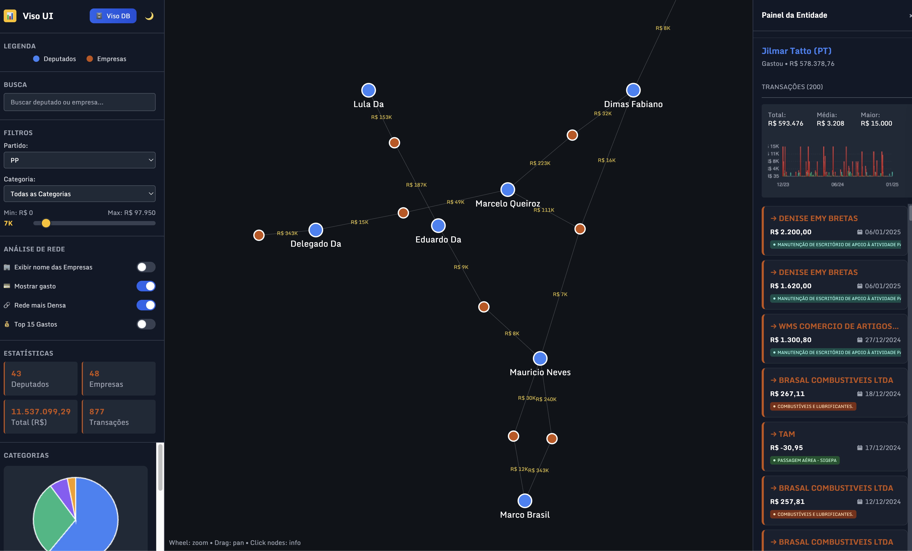
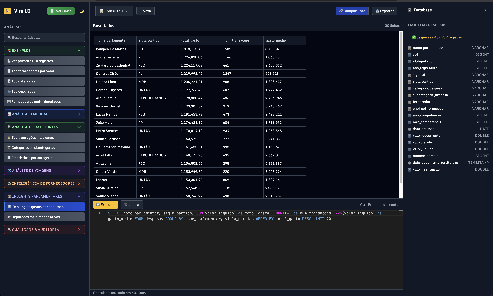

# 🕸️ VISO - Visualização Integrada de Sistemas Oficiais

Explore gastos de deputados federais através de visualizações interativas e consultas SQL diretas com os dados da Câmara dos Deputados.

## 🎯 O que você pode descobrir
- **Quanto cada deputado gasta** e conexões com empresas
- **Padrões suspeitos** entre políticos e empresas  
- **Análises customizadas** através de consultas SQL

## 🔧 Duas Interfaces Integradas

### 📊 Visualização em Rede
Interface principal com grafo interativo de conexões deputado-empresa.
- **Nós azuis**: Deputados | **Nós vermelhos**: Empresas
- **Filtros inteligentes**: partido, categoria, valor mínimo
- **Interativo**: zoom, pan, clique para detalhes

### 🗄️ Explorador SQL 
Ferramenta para análises avançadas com consultas personalizadas.
- **Consultas pré-definidas** para análises comuns
- **Editor profissional** com syntax highlighting
- **Execução rápida** (Ctrl+Enter) e resultados paginados

## 🛠️ Stack Tecnológico
- **Frontend**: HTML5, Tailwind CSS, JavaScript ES6+
- **Banco**: DuckDB WASM para SQL no browser
- **Visualização**: D3.js para gráficos interativos
- **Editor**: Monaco (VS Code web)
- **Dados**: Parquet para performance otimizada
- **🆕 Storage**: OPFS (Origin Private File System) para persistência local
- **🆕 Workers**: Web Workers dedicados para processamento assíncrono
- **🆕 Cache**: Sistema de cache multi-camada com compressão
- **🆕 Offline**: Suporte completo para modo offline

## 📈 Casos de Uso
**Profissionais**: Jornalistas investigativos, pesquisadores, advogados, ativistas  
**Cidadãos**: Fiscalização popular, conhecer candidatos, aprendizado democrático

**Resultados esperados**: Maior transparência, deputados mais responsáveis, democracia fortalecida

## 🔒 Ética e Responsabilidade
- **100% dados públicos** oficiais da Câmara dos Deputados  
- **Uso responsável**: contextualize sempre, não faça acusações sem investigação aprofundada
- **Presunção de inocência**: dados mostram gastos, não comprovam irregularidades

## 🚀 Recursos Avançados

### ⚡ Performance Otimizada
- **Carregamento Instantâneo**: Dados em cache carregam imediatamente
- **Workers Dedicados**: Processamento pesado em background
- **Compressão Automática**: Reduz uso de storage em até 50%
- **Cache Inteligente**: Sistema multi-camada com TTL configurável

### 📱 Modo Offline
- **Funciona Offline**: Funcionalidades principais disponíveis sem internet
- **Sync Automático**: Atualização automática quando volta online
- **Storage Local**: Dados persistem entre sessões usando OPFS
- **Fallbacks Inteligentes**: Degrada graciosamente sem perder funcionalidade

### 🔧 Gerenciamento de Storage
- **Interface de Gerenciamento**: UI completa para controlar cache e storage
- **Monitoramento**: Estatísticas detalhadas de uso e performance
- **Limpeza Automática**: Remove dados expirados automaticamente
- **Controle Granular**: Gerencia datasets, cache e arquivos temporários

### 📊 Monitoramento de Performance
- **Métricas em Tempo Real**: Taxa de cache hit, uso de memória, tempos de resposta
- **Recomendações**: Sugestões automáticas para otimização
- **Alertas**: Notificações para problemas de performance
- **Relatórios**: Dados completos para análise de performance

---

💡 **Dica**: Use ambas interfaces! Explore visualmente no grafo, depois faça consultas específicas no SQL.

---

*Desenvolvido para fortalecer a democracia brasileira através da transparência*
