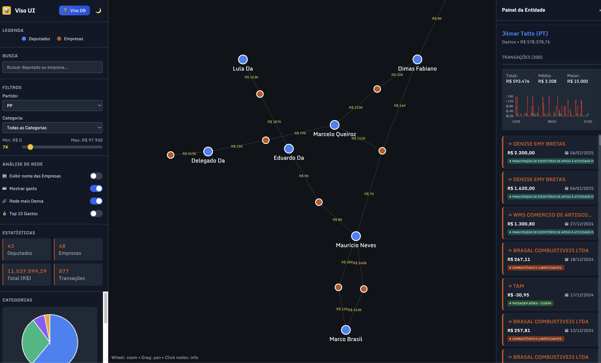
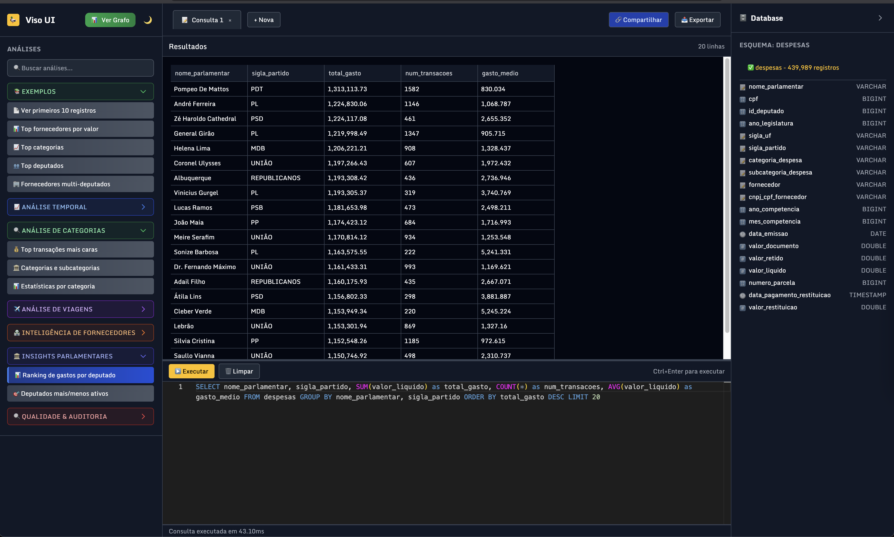

# 🕸️ VISO - Visualização Integrada de Sistemas Oficiais

Explore gastos de deputados federais através de visualizações interativas e consultas SQL diretas com os dados da Câmara dos Deputados.

## 🎯 O que você pode descobrir
- **Quanto cada deputado gasta** e conexões com empresas
- **Padrões suspeitos** entre políticos e empresas  
- **Análises customizadas** através de consultas SQL

## 🔧 Duas Interfaces Integradas

### 📊 Visualização em Rede
Interface principal com grafo interativo de conexões deputado-empresa.
- **Nós azuis**: Deputados | **Nós vermelhos**: Empresas
- **Filtros inteligentes**: partido, categoria, valor mínimo
- **Interativo**: zoom, pan, clique para detalhes
- **🆕 URLs Compartilháveis**: Links diretos para deputados e empresas específicas

### 🗄️ Explorador SQL 
Ferramenta para análises avançadas com consultas personalizadas.
- **Consultas pré-definidas** para análises comuns
- **Editor profissional** com syntax highlighting
- **Execução rápida** (Ctrl+Enter) e resultados paginados

### 🔗 URLs Compartilháveis
- **Links Diretos**: Compartilhe visualizações específicas com URLs únicos
- **Formato Intuitivo**: `/deputado-nome-e-partido` e `/empresa-nome-empresa`
- **Navegação Natural**: Botões voltar/avançar do browser funcionam perfeitamente
- **Compatibilidade**: URLs antigas continuam funcionando para transição suave

## 📈 Casos de Uso
**Profissionais**: Jornalistas investigativos, pesquisadores, advogados, ativistas  
**Cidadãos**: Fiscalização popular, conhecer candidatos, aprendizado democrático
**Resultados esperados**: Maior transparência, deputados mais responsáveis, democracia fortalecida

## 🔒 Ética e Responsabilidade
- **100% dados públicos** oficiais da Câmara dos Deputados  
- **Uso responsável**: contextualize sempre, não faça acusações sem investigação aprofundada
- **Presunção de inocência**: dados mostram gastos, não comprovam irregularidades

## 🛠️ Stack Tecnológico
- **Frontend**: HTML5, Tailwind CSS, JavaScript ES6+
- **Banco**: DuckDB WASM para SQL no browser
- **Visualização**: D3.js para gráficos interativos
- **Editor**: Monaco (VS Code web)
- **Dados**: Parquet para performance otimizada
- **🆕 Storage**: OPFS (Origin Private File System) para persistência local
- **🆕 Workers**: Web Workers dedicados para processamento assíncrono
- **🆕 Cache**: Sistema de cache multi-camada com compressão
- **🆕 Offline**: Suporte completo para modo offline
- **🆕 Routing**: Sistema de URLs compartilháveis com navegação SPA

### ⚡ Performance Otimizada
- **Carregamento Instantâneo**: Dados em cache carregam imediatamente
- **Workers Dedicados**: Processamento pesado em background
- **Funciona Offline**: Funcionalidades principais disponíveis sem internet
- **Sync Automático**: Atualização automática quando volta online
- **Storage Local**: Dados persistem entre sessões usando OPFS

#### Core Components
- **OPFS Storage Manager**: Armazenamento local persistente de arquivos
- **File System Worker**: Lida com operações OPFS fora do thread principal
- **Data Processing Worker**: Cálculos SQL pesados e processamento de dados
- **Background Sync Worker**: Atualizações e sincronização automáticas de dados
- **Cache Manager**: Cache avançado com compactação e controle de versão
- **Offline Data Manager**: Orquestra todos os componentes para suporte offline

---

💡 **Dica**: Use ambas interfaces! Explore visualmente no grafo, depois faça consultas específicas no SQL.

---

*Desenvolvido para fortalecer a democracia brasileira através da transparência e auditoria pública*
